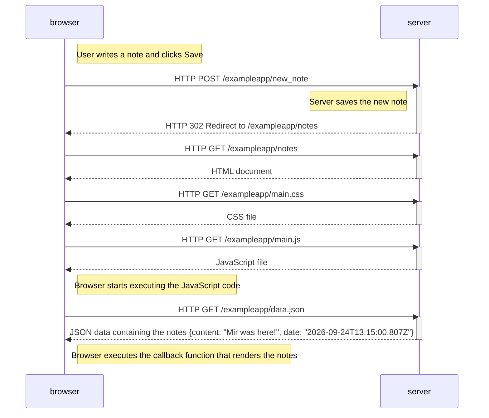

```mermaid
sequenceDiagram
    participant browser
    participant server

    Note right of browser: User writes a note and clicks Save

    browser->>server: HTTP POST /exampleapp/new_note
    activate server
    Note left of server: Server saves the new note
    server-->>browser: HTTP 302 Redirect to /exampleapp/notes
    deactivate server

    browser->>server: HTTP GET /exampleapp/notes
    activate server
    server-->>browser: HTML document
    deactivate server

    browser->>server: HTTP GET /exampleapp/main.css
    activate server
    server-->>browser: CSS file
    deactivate server

    browser->>server: HTTP GET /exampleapp/main.js
    activate server
    server-->>browser: JavaScript file
    deactivate server

    Note right of browser: Browser starts executing the JavaScript code

    browser->>server: HTTP GET /exampleapp/data.json
    activate server
    server-->>browser: JSON data containing the notes {content: "Mir was here!", date: "2026-09-24T13:15:00.807Z"}
    deactivate server

    Note right of browser: Browser executes the callback function that renders the notes
```