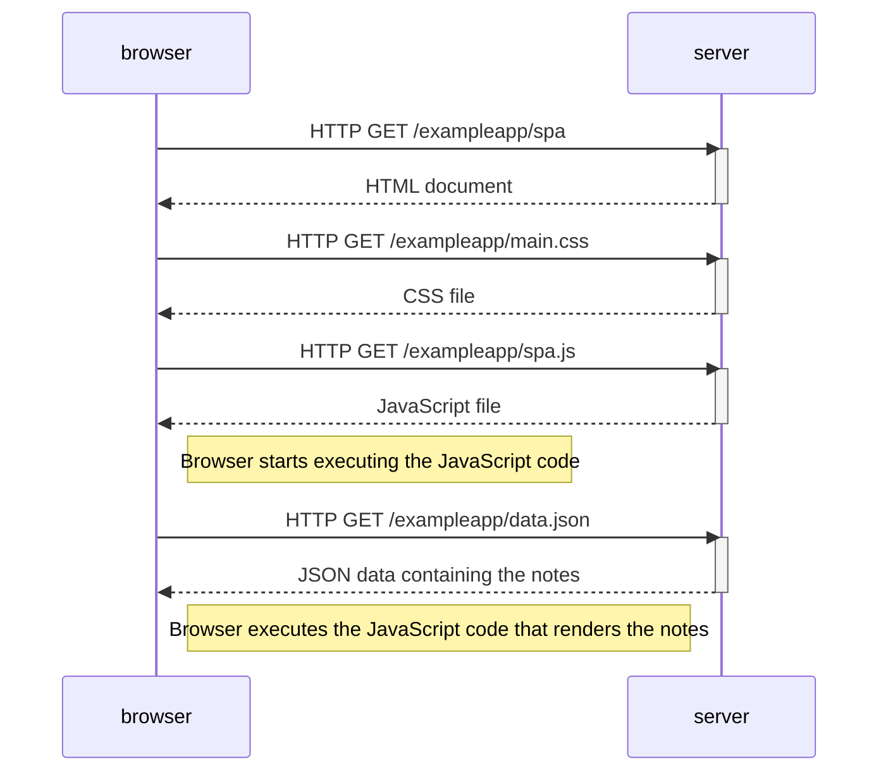

```mermaid
sequenceDiagram
    participant browser
    participant server

    browser->>server: HTTP GET /exampleapp/spa
    activate server
    server-->>browser: HTML document
    deactivate server

    browser->>server: HTTP GET /exampleapp/main.css
    activate server
    server-->>browser: CSS file
    deactivate server

    browser->>server: HTTP GET /exampleapp/spa.js
    activate server
    server-->>browser: JavaScript file
    deactivate server

    Note right of browser: Browser starts executing the JavaScript code

    browser->>server: HTTP GET /exampleapp/data.json
    activate server
    server-->>browser: JSON data containing the notes
    deactivate server

    Note right of browser: Browser executes the JavaScript code that renders the notes
```