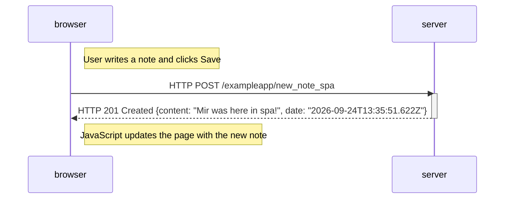

```mermaid
sequenceDiagram
    participant browser
    participant server

    Note right of browser: User writes a note and clicks Save

    browser->>server: HTTP POST /exampleapp/new_note_spa
    activate server
    server-->>browser: HTTP 201 Created {content: "Mir was here in spa!", date: "2026-09-24T13:35:51.622Z"}
    deactivate server

    Note right of browser: JavaScript updates the page with the new note
```